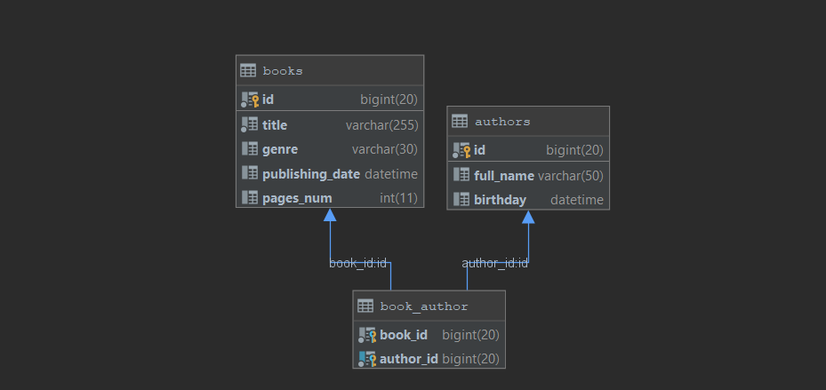

# JOOQ lib demo

**How to test:**

* Run sql script to fill up db: `src/main/resources/init.sql`

* Setup your db connection for JOOQ codegen in: `jooq-config.xml`

* Run JOOQ codegen: `sh jooq_updater.sh`

* Done, now just run one of `*Test.java` classes 
with command line arguments in format:
`user password host port db_schema_name`

**DB schema UML:**

